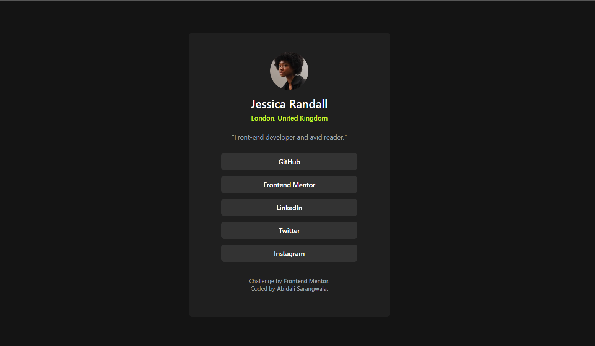

# Frontend Mentor - Social links profile solution

This is a solution to the [Social links profile challenge on Frontend Mentor](https://www.frontendmentor.io/challenges/social-links-profile-UG32l9m6dQ). Frontend Mentor challenges help you improve your coding skills by building realistic projects. 

## Table of contents

- [Overview](#overview)
  - [The challenge](#the-challenge)
  - [Screenshot](#screenshot)
  - [Links](#links)
  - [Built with](#built-with)
- [Author](#author)

**Note: Delete this note and update the table of contents based on what sections you keep.**

## Overview
 I was able to create a social link card using html, css and tailwind.

### The challenge

Users should be able to:

- See hover and focus states for all interactive elements on the page

### Screenshot

### Links

- Solution URL: [Add solution URL here](https://www.frontendmentor.io/solutions/responsive-social-link-card-using-flexbox-and-tailwindcss-SOfE_jUuzI)
- Live Site URL: [Add live site URL here](https://caspgin.github.io/FrontEnd-Mentor-Challenge---Social-Link-Card/)

### Built with

- Semantic HTML5 markup
- Flexbox
- CSS Grid
- Mobile-first workflow
- TailwindCSS

## Author

- Website - [Abidali Sarangwala]
- Frontend Mentor - [@caspgin](https://www.frontendmentor.io/profile/caspgin)

